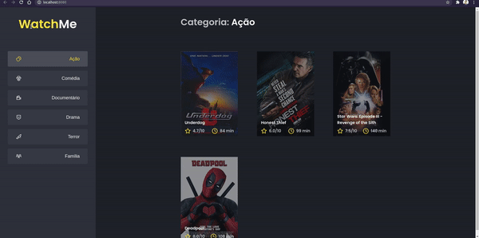

# 💻 Sobre o desafio

Nesse desafio, o meu principal objetivo é refatorar uma página para listagem de filmes de acordo com gênero. 

A aplicação já estava totalmente funcional mas grande parte do seu código estava diretamente no arquivo `App.tsx`. Para resolver isso da melhor forma, foi necessário dividir a aplicação em pelo menos duas partes principais: `sidebar` e `content`, que possui o header e a listagem de filmes.

- A aplicação possui apenas uma funcionalidade principal que é a listagem de filmes;
- Na sidebar é possível selecionar qual categoria de filmes deve ser listada;
- A primeira categoria da lista (que é "Ação") já deve começar como marcada;
- O header da aplicação possui apenas o nome da categoria selecionada que deve mudar dinamicamente.

# 🏃 Rodando a aplicação

Abra no Visual Studio Code e execute os seguintes comandos no terminal:

```bash
yarn
yarn server
yarn dev
```

Em seguida você pode abri no browser em 'http://localhost:8080'

<p align="center">
  
</p>